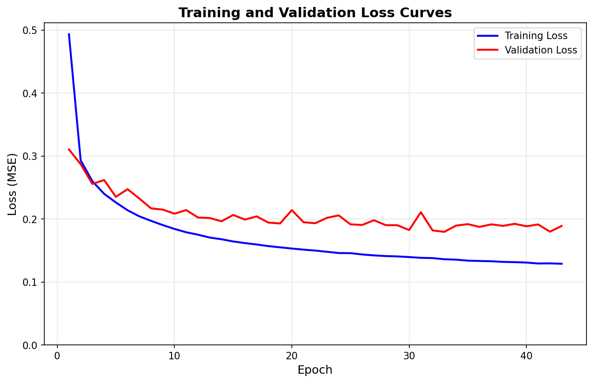

# MuJoCo Simulator for Pick/Place Robot Arm Policy Training

## Summary

I set up a MuJoCo simulator to create robot trajectory data of a UR5e robotic arm picking and placing a cuboid object. This was used to train an MLP policy that predicted joint-velocities for each timestep, getting 47% accuracy.

## MuJoCo Simulation

Initialized a UR5e robotic arm and Robotiq 2F-85 gripper attached to a table with an object on it. The object size, orientation, and position on the table were all randomly generated to allow generalization. The simulation executed 10 steps:

| Step | Description |
|------|-------------|
| 0 | 30cm above initial object |
| 1 | 10cm above initial object, helps vertical approach |
| 2 | At object middle |
| 3 | Grasp at object middle |
| 4 | Lift to 30cm above initial pos |
| 5 | Above target |
| 6 | To help slow down approach, above target position |
| 7 | Placing block, right above the table |
| 8 | Release block |
| 9 | Up from target |

At each step, the target position and target orientation (vertical for grasping steps) were used with Mink to generate an SE3 target transform for the end-effector (the gripper). Mink was then used to get joint-velocities through inverse kinematics, and MuJoCo integrated these for each timestep.

**Gaussian noise injection:** Noise injection was tested but ultimately hurt performance. Noise was added to target position during rollout while recording unnoised targets for training.

## Model Architecture

Trained an MLP with 31D inputs, which were:
- Joint positions (6)
- Joint velocities (6)
- End-effector position (3)
- End-effector quaternion (4)
- Object position (3)
- Object quaternion (4)
- Object size (3)
- Gripper joint position (1)
- Gripper joint velocity (1)

The outputs were 6D joint velocities and 1 gripper state x10 because we used action chunking, where we predict the actions for the next N timesteps the arm ought to take in order to help the model predict smoother action sequences. During rollout, we just sample the first action and recompute the chunk each timestep.

We use 3 hidden layers with size 256 just to get enough model capacity. Early stopping and regularization will help us find a model that generalizes (double descent says this is better than a smaller model). We enforce the same velocity limits as used in the IK solver by having the actually velocities be `v=v_max*tanh(model(input))`.

## Training

Loss function was a combination of MSE loss for joint velocities and BCE loss for the gripper state (open/closed). A full hyperparameter sweep was done, but lower val/test loss did not correspond to better performance during rollout. The final hyperparameters ended up using:
- AdamW optimizer
- No lr scheduler
- `lr=3e-4`
- `wd=1e-4`
- `batch_size=256`
- Early stopping with patience 10 epochs
- BCE loss multiplied by 6 when added to the MSE loss (to balance the gripper/joint losses)

Data was split 80%, 10%, 10% into train/val/test by trajectory. Then, trajectories were split into individual (state, 10 x action) pairs for use in training/evaluation.

### Loss Curves

**Loss curve for best model:**



**Some more optimized loss curves that perform worse (this one got 8% during rollout):**


## Rollout Issues

The model does not do nearly as well during rollout as the simulation does. The model can't perfectly reproduce the simulations for all possible positions/sizes, so it'll drift a tiny bit, leading to distribution shift. I tried:

1. Action chunking
2. Gaussian noise injection
3. Hyperparam sweep for better loss (somehow made it worse, I think maybe overfit even worse to the training data when we want generalization).
4. Adding to the above, learning rate scheduler made it worse.
5. More data
6. Switching from MSE to BCE loss for the gripper.

## Results

The best trained model used the above hyperparameters, and the second best used the above hyperparams with a scheduler to decrease lr when the val loss hit a plateau. The third best model used the same with more data (about 1000 runs).

A test script was used that terminated model rollout when the object was within 5cm of the target position and the EE was more than 10cm from the object, which was defined as success, or after 10,000 timesteps, which was defined as failure.

**The best model (checkpoint `20260101_032252`) achieved 47% accuracy.**

The cool thing about rollout is sometimes the model misses the object, but it learns to open and try again to pick it up—unlike the action plan, if it misses the object and opens again, it's actually in a similar position to the training data when it hasn't picked up the object yet.

## Future Ideas

1. Make Gaussian noise injection better. Should probably choose with a certain probability whether we inject noise, then sample some noise parameter and apply it for the next k steps (so we actually perturb the path). Could also limit this to near gripping only (where mistakes are made).
2. Try DAgger (switch back to sim after the policy messes up, add this to training data).
3. Idea I had that I don't know if it's in literature—take the MLP rollouts that work and add that to training data. It would probably help generalization, feels like somewhere between DAgger and RL and maybe it's just suboptimal compared to those two.
4. Change architecture to ACT or diffusion policy.
5. More data? currently trying this
6. Better hyperparameter choices

## Running

Choose parameters in `config.py` and then run:

```bash
mjpython collect_data.py
```

The number of runs this collects is configured in `config.py`. Most models used 500 runs, I tried increasing dataset size later but didn't show improvement.

If you want to just run a sim with ik, you can run:

```bash
mjpython run_sim.py --mode ik
```

You can also add:
- `--sleep 0.01` to slow down the run
- `--save-video` to save the video
- `--video-path` to change the saved video file path
- `--noise` to change noise used during ik (default 0.0)
- `--headless` to run without the video showing

To train, run:

```bash
python train.py
```

(this will use the latest dataset, which is usually what we want). Hyperparams can be changed in `config.py`.

To use during rollout, run:

```bash
mjpython run_sim.py --mode model
```

This will use the latest trained model, add `--checkpoint` with the id to use a specific model, and the same extra options as with ik for video saving, slowing it down, headless.

The test script can be run with:

```bash
mjpython test_specific_models.py --checkpoint {checkpoint #}
```

or

```bash
mjpython test_specific_models.py --checkpoint latest
```

or

```bash
mjpython test_specific_models.py --all
```